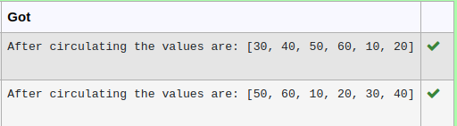

# Circulate-the-values-of-N-variables
## Aim:
To write a python program to circulate the n variables using function concept
## Equipment’s required:
PC
Anaconda - Python 3.7
## Program:
```
def circulate():
    a=eval(input())
    n=int(input())
    a=a[n:]+a[:n]
    print("After circulating the values are:",a)    

```


## Output:


## Result:
Thus Circulate-the-values-of-N-variables is successfully executed.
